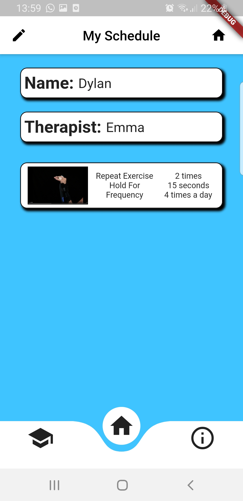
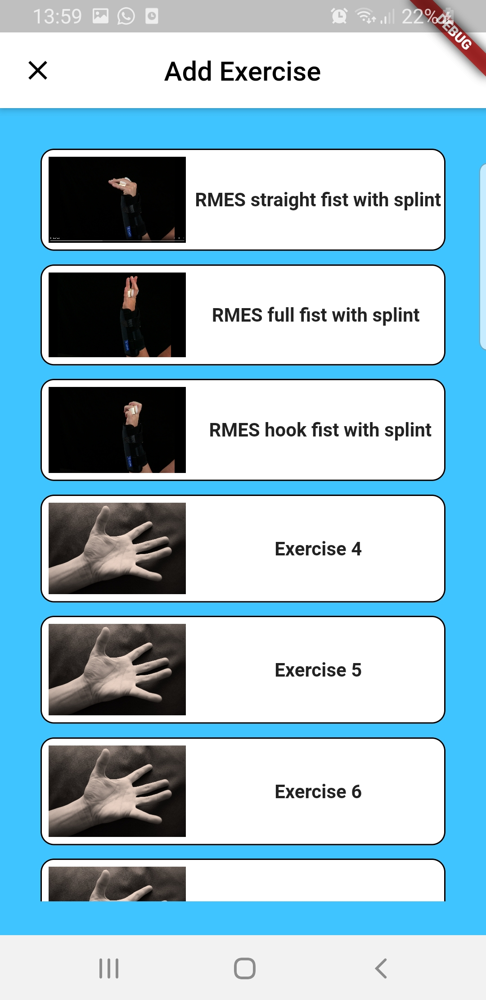
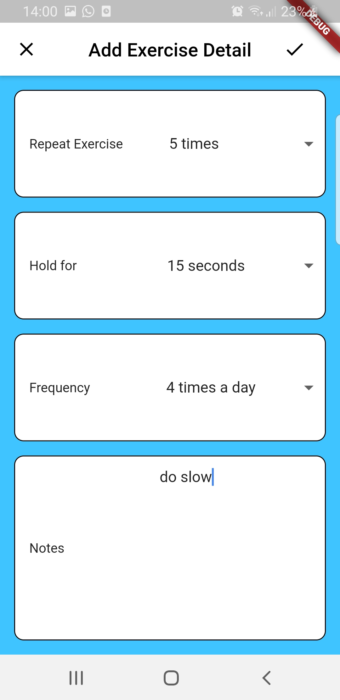
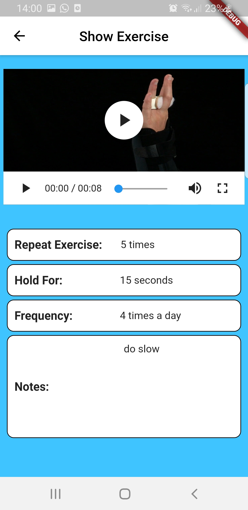
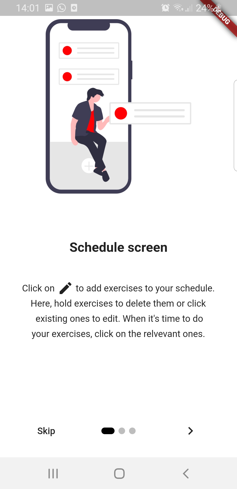
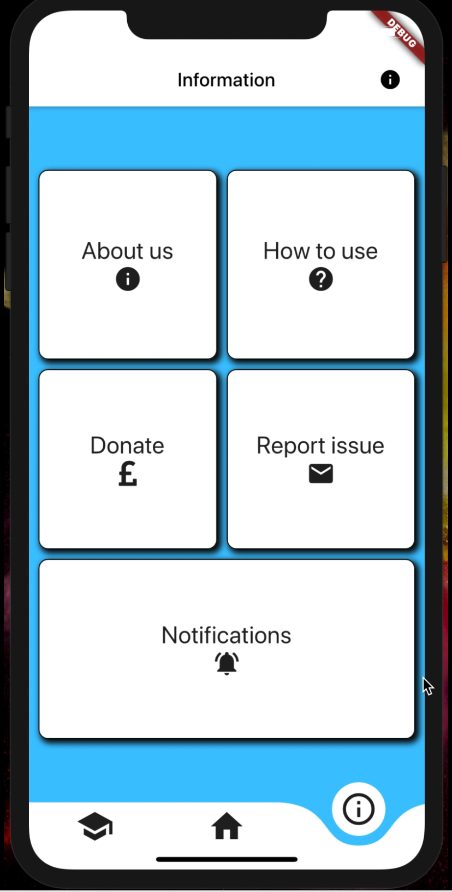
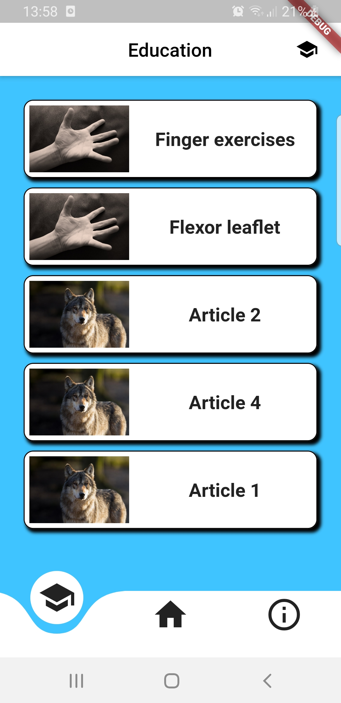

# hand_app

This was a concept application made for patients at Royal Derby Hospital's Hand centre to help them during reabilitation process. User can set their own schedules, choosing videos stored in Firebase. They can also learn more about their injury by reading articles which are also stored in Firebase. User can also set notifications to remind them to complete exercise aswell as other functions in the info page. User is also greeted by cool onboarding screen when first launching the app.

To run this application you will need to add the Firebase configuration files to ios and Android folder.

 

